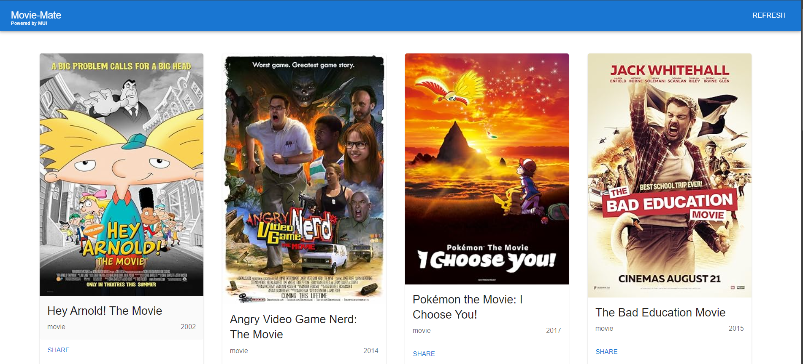
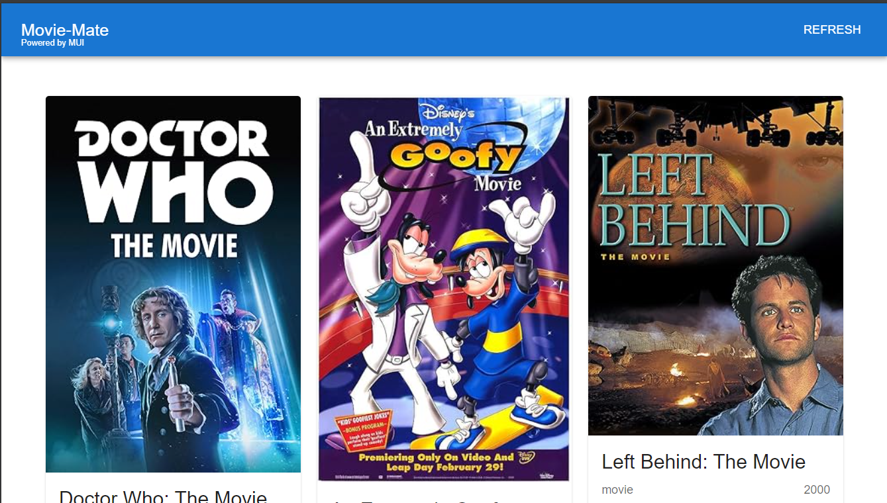
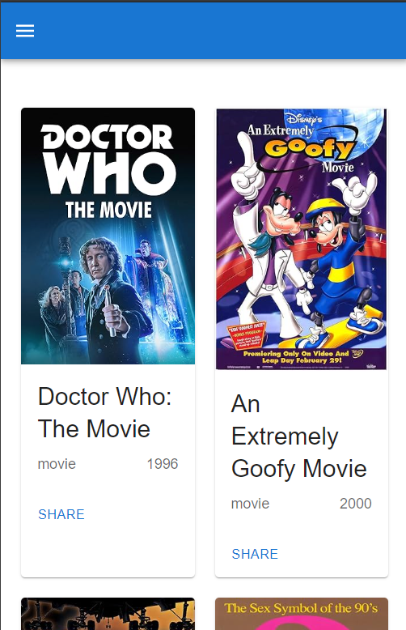

# Movie-Mate

Movie-Mate is a movie search application built with React, TypeScript, and Vite. The application allows users to search for movies, filter them by category (Hindi, English), and view details such as title, poster, year, and type.

## Features

- **Explore for Movies**: Explore for movies using the OMDb API.
- **Refresh Movies**: Refresh movies by random by taping on button.
- **Responsive Design**: The app is built with MUI for a responsive user interface.

## Technologies Used

- **React**: JavaScript library for building user interfaces.
- **TypeScript**: Typed superset of JavaScript for better tooling and debugging.
- **Vite**: Build tool that provides a faster and leaner development experience.
- **MUI**: React components for faster and easier web development.
- **OMDb API**: API to fetch movie data.

## Installation

1. Clone the repository:
   ```bash
   git clone https://github.com/AdityaBhojane/Movie-Mate.git
   ```

## ScreenShorts 





